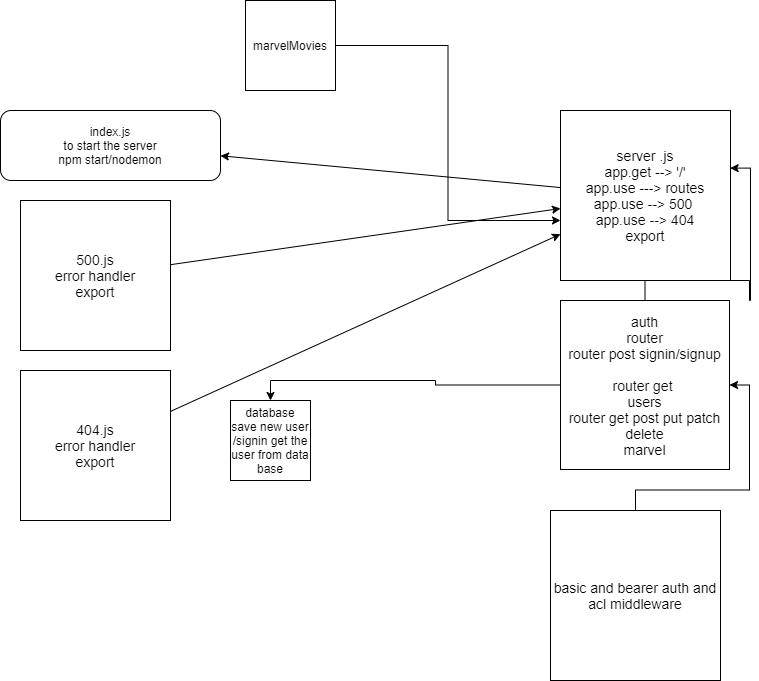

# marvel-movies

## Authors: Ibrahem Sarayrah , Mahmoud Khader , Mohammad atta

## Links and Resources:

### Heroku:

https://marvel-movies.herokuapp.com/

* ### github :

https://github.com/IbrahemSarayrah/marvel-movies


## Setup 
### .env requirements :
* ### PORT=3000
* ### DATABASE_URL
* ### SECRET
* ### NODE_ENV=test


## Dependencies needs to install
* ### npm init -y
* ### npm i dotenv express cors 
* ### npm i -D jest supertest 
* ### npm i sequelize 
* ### npm i sqlite3
* ### npm i pg
* ### npm i morgan
* ### npm i jsonwebtoken
* ### npm i bcrypt
* ### npm i base-64

## To Run the Application
* ### clone the repository
* ### run the command (nodemon)

## How to initialize/run your application (where applicable)

* ### nodemon - node index.js

* ### Endpoints:
    * ### home route (/)
    * ### for create (/signup)
    * ### for login (/signin)
    * ### for login (/updateAccount)
    * ### for login (/deleteAccount)
    * ### for get (/users)
    * ### for getAll (/marvel)
    * ### for create(/marvel)
    * ### for getOne (/marvel/:id)
    * ### for update(/marvel/:id)
    * ### for delete(/marvel/:id)

 ## Testing

- Returns Object

```
{
  "username":"name provided",
  "password":"pass",
  "role":[user,admin]
},
{
    "favMovie":"test",
    "favHero":"test",
    "favQuote":"test"
    "releaseDate":"test"

},

```

### Run tests with :
 * ### npm run test

* UML


